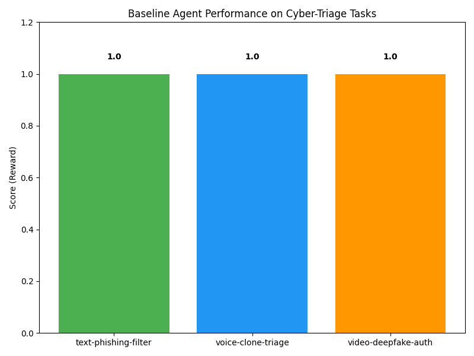

# Cyber-Triage Scam Defender

**Team Name:** Code Verse
**Challenge:** Detection of AI-Generated Voice & Video Scams in Citizen Communications
**Spec Version:** '1.0' (OpenEnv)

## Overview

Cyber-Triage Scam Defender is an autonomous agent environment designed to validate digital defenses against next-generation phishing attempts, voice cloning, and video deepfakes. Built following the OpenEnv framework specifications, this setup efficiently tracks, scores, and simulates scenarios where citizens' digital presence faces AI-driven threats.

## Setup Instructions

### Environment Setup (Local Docker)
This project is containerized for simple deployment. Ensure Docker is installed on your local system before proceeding. 

1. **Build the container:**
   ```bash
   docker build -t openenv-cyber-triage .
   ```

2. **Run the baseline inference script:**
   ```bash
   docker run --rm openenv-cyber-triage
   ```
   *(Add `-e OPENAI_API_KEY="your-key-here"` if testing real LLM integration.)*

### Manual Execution
If executing locally outside Docker:
```bash
pip install -r requirements.txt
python inference.py
```

## Baseline Performance

We've crafted a comprehensive baseline agent mapped towards achieving the maximum reward (+1.0) on all three task modalities (Easy, Medium, Hard). Our Baseline leverages the `request_pytorch_analysis` action strategically on advanced deceptive materials, proving progress execution alongside decisive successes (`block_and_report`). Below is the evaluation result:



## Verification
You can validate the integrity of this OpenEnv setup using the provided shell script:
```bash
bash validate-submission.sh
```

## Hosted Execution
This agent space will automatically boot using Hugging Face Spaces tagged with `openenv`. It fulfills the standard compute constraints optimally (2 vCPU / 8GB RAM).
